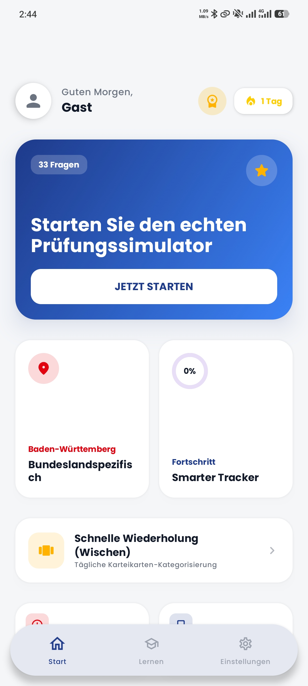
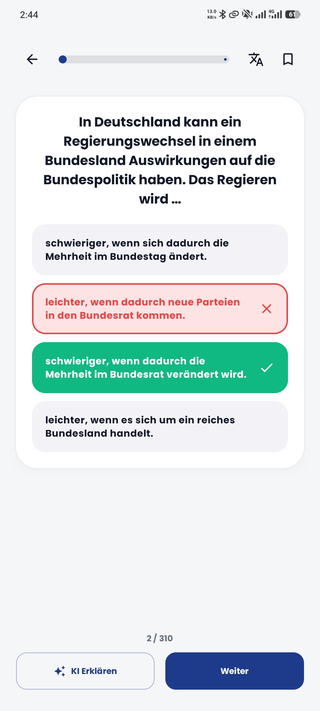
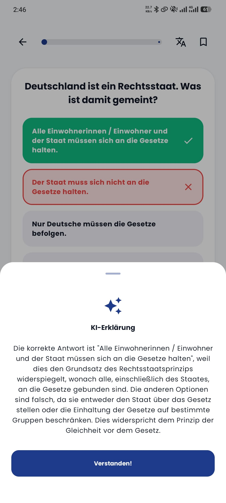
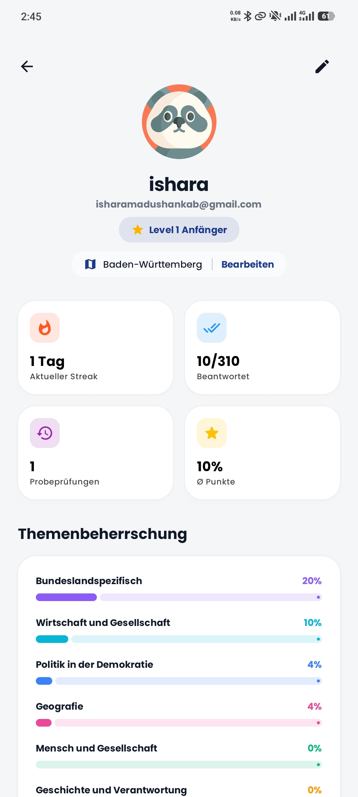

# Einbürgerungstest 2026

A modern, AI-powered solution for mastering the German Citizenship Test with precision and ease.

<p align="center">
  <a href="https://play.google.com/store/apps/details?id=com.pixeleye.einbuergerungstest.lebenindeutschland">
    
  </a>
</p>

## Overview

Einbürgerungstest 2026 is a premium Android application designed to help users prepare for the official "Leben in Deutschland" (Living in Germany) exam. The app provides a comprehensive, gamified learning experience, integrating the complete BAMF question catalog with state-of-the-art AI explanations and seamless cloud synchronization. Built with a minimalist professional aesthetic, it caters to the high standards of the European market while remaining accessible to learners from all backgrounds.

## Core Features

*   **Complete BAMF Catalog**: Access all 300+ official questions from the Federal Office for Migration and Refugees (BAMF).
*   **State-Specific Filtering**: Targeted practice for the 10 region-specific questions based on your selected German federal state.
*   **Llama 3 AI Explanations**: Deep, contextual insights into every question powered by the Groq API (Llama 3.3 70B), providing clarity on complex political and historical topics.
*   **Swipe Flashcards**: A Tinder-style categorization interface for rapid-fire review and active recall.
*   **Intelligent Exam Simulator**: Realistic mock exams that mirror the actual test environment and scoring logic.
*   **PDF Export**: Generate high-quality PDF reports of your mistakes and bookmarks for offline study or printing.
*   **Smart Progress Tracking**: Detailed statistics on category mastery, average scores, and learning trends.
*   **Daily Streaks & Reminders**: Gamified consistency tracking with a dedicated Homescreen Widget (Jetpack Glance) and automated notifications.
*   **Multilingual Support**: Fully localized in German, English, Turkish, Arabic, and Persian.
*   **Secure Cloud Sync**: Cross-device progress synchronization using Firebase Firestore and Authentication.

## Tech Stack

*   **Language**: Kotlin
*   **UI Framework**: Jetpack Compose (Modern Declarative UI)
*   **Architecture**: MVVM (Model-View-ViewModel) with Clean Architecture principles
*   **Dependency Injection**: Hilt (Dagger)
*   **Database**: Room (Local persistence with SQLite)
*   **Networking**: OkHttp & Gson
*   **AI Integration**: Groq API (Llama 3.3 70B Versatile)
*   **Cloud Backend**: Firebase (Auth, Firestore, Analytics)
*   **Monetization**: Google AdMob (Banners/Interstitials) and RevenueCat (Subscription management)
*   **Offline Translation**: ML Kit Translate
*   **Background Tasks**: WorkManager for daily reminders
*   **Widgets**: Jetpack Glance for homescreen interactions

## Architecture

The project implements a layered architecture ensuring separation of concerns and high testability:

*   **Data Layer**: Manages data sources through a Repository pattern. It handles local caching via **Room** and remote synchronization via **Firebase** and the **Groq API**.
*   **UI Layer**: Utilizes **Jetpack Compose** for building a reactive UI. State management is handled through **StateFlow** within **ViewModels**, which interact with the data layer to provide a seamless user experience.
*   **Dependency Injection**: **Hilt** is used throughout the project to manage the lifecycle of dependencies and ensure modularity.

## Setup & Installation

### Prerequisites

*   Android Studio Ladybug (2024.2.1) or later
*   JDK 11 or higher
*   A valid Groq API Key
*   Google Services configuration (google-services.json)

### Local Configuration

Before building the project, you must set up your environment variables in the `local.properties` file:

```properties
GROQ_API_KEY=your_groq_api_key
ADMOB_APP_ID=your_admob_app_id
ADMOB_BANNER_ID=your_admob_banner_id
ADMOB_INTERSTITIAL_ID=your_admob_interstitial_id
REVENUECAT_API_KEY=your_revenuecat_api_key
```

### Build & Run

1.  Clone the repository.
2.  Open the project in Android Studio.
3.  Sync the project with Gradle files.
4.  Run the `app` module on a physical device or emulator (API 24+).

## Screenshots

| Dashboard | Swipe Flashcards | Exam Simulator | AI Explanations |
| :---: | :---: | :---: | :---: |
|  |  |  |  |

## License

Copyright (c) 2026 Pixeleye.

This project is licensed under the MIT License - see the LICENSE file for details.
